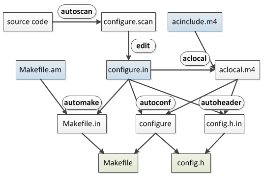

## 7.1 扩展的构成及编译

### 7.1.1 扩展能做什么
扩展是PHP的重要组成部分，它是PHP提供给开发者用于扩展PHP语言功能的主要方式。开发者可以用C/C++定义自己的功能，通过扩展嵌入到PHP中，灵活的扩展能力使得PHP拥有了大量、丰富的第三方组件，这些扩展很好的补充了PHP的功能、特性，大大提高了PHPer的开发效率，使得PHP在web开发中得以大展身手。

C语言是PHP之母，笔者认为：C语言是世界上最好的语言！自它诞生至今，C语言孕育了大量优秀、知名的项目：Linux、Nginx、MySQL、PHP、Redis、Memcached等等，感谢里奇带给这个世界如此伟大的一份礼物。C语言的优秀也折射到PHP身上，但是PHP内核提供的功能终究有限，如果你发现PHP在某些方面已经满足不了你的需求了，那么不妨试试扩展，当然扩展也不是万能的。

常见的，扩展可以在以下几个方面有所作为：
* __介入PHP的编译、执行阶段：__ 可以介入PHP框架执行的那5个阶段，比如opcache，就是重定义了编译函数
* __提供内部函数：__ 可以定义内部函数扩充PHP的函数功能，比如array、date等操作
* __提供内部类__
* __实现RPC客户端：__  实现与外部服务的交互，比如redis、mysql等
* __提升执行性能：__ PHP是解析型语言，在性能方面远不及C语言，可以将耗cpu的操作以C语言代替
* ......

PHP中的扩展分为两类：PHP扩展、Zend扩展，对内核而言这两个分别称之为：模块(module)、扩展(extension)，本章主要介绍是PHP扩展，也就是模块。

### 7.1.2 脚本工具
PHP提供了几个脚本工具用于简化扩展的实现：ext_skel、phpize、php-config，后面两个脚本主要配合autoconf、automake生成Makefile。在介绍这几个工具之前，我们先看下PHP安装后的目录结构，因为很多脚本、配置都放置在安装后的目录中，比如PHP的安装路径为：/usr/local/php7，则此目录的主要结构：
```c
|---php7
|   |---bin //php编译生成的二进制程序目录
|       |---php //cli模式的php
|       |---phpize      
|       |---php-config
|       |---...
|   |---etc     //一些sapi的配置    
|   |---include //php源码的头文件
|       |---php
|           |---main    //PHP中的头文件
|           |---Zend    //Zend头文件
|           |---TSRM    //TSRM头文件
|           |---ext     //扩展头文件
|           |---sapi    //SAPI头文件
|           |---include
|   |---lib //依赖的so库
|       |---php
|           |---extensions  //扩展so保存目录
|           |---build       //编译时的工具、m4配置等，编写扩展是会用到
|               |---acinclude.m4    //PHP自定义的autoconf宏
|               |---libtool.m4      //libtool定义的autoconf宏，acinclude.m4、libtool.m4会被合成aclocal.m4
|               |---phpize.m4       //PHP核心configure.in配置
|               |---...
|           |---...
|   |---php
|   |---sbin //SAPI编译生成的二进制程序，php-fpm会放在这
|   |---var  //log、run日志
```

#### 7.1.2.1 ext_skel
这个脚本位于PHP源码/ext目录下，它的作用是用来生成扩展的基本骨架，帮助开发者快速生成一个规范的扩展结构，可以通过以下命令生成一个扩展结构：
```c
./ext_skel --extname=扩展名称
```
执行完以后会在ext目录下新生成一个扩展目录，比如extname是mytest，则将生成以下文件：
```c
|---mytest 
|   |---config.m4     //autoconf规则的编译配置文件
|   |---config.w32    //windows环境的配置
|   |---CREDITS
|   |---EXPERIMENTAL
|   |---include       //依赖库的include头文件，可以不用
|   |---mytest.c      //扩展源码
|   |---php_mytest.h  //头文件
|   |---mytest.php    //用于在PHP中测试扩展是否可用，可以不用
|   |---tests         //测试用例，执行make test时将执行、验证这些用例
|       |---001.phpt
```
这个脚本主要生成了编译需要的配置以及扩展的基本结构，初步生成的这个扩展可以成功的编译、安装、使用，实际开发中我们可以使用这个脚本生成一个基本结构，然后根据具体的需要逐步完善。
### 7.1.2.2 php-config
这个脚本为PHP源码中的/script/php-config.in，PHP安装后被移到安装路径的/bin目录下，并重命名为php-config，这个脚本主要是获取PHP的安装信息的，主要有：
* __PHP安装路径__
* __PHP版本__
* __PHP源码的头文件目录：__ main、Zend、ext、TSRM中的头文件，编写扩展时会用到这些头文件，这些头文件保存在PHP安装位置/include/php目录下
* __LDFLAGS：__ 外部库路径，比如：`-L/usr/bib -L/usr/local/lib`
* __依赖的外部库：__ 告诉编译器要链接哪些文件，`-lcrypt   -lresolv -lcrypt`等等
* __扩展存放目录：__ 扩展.so保存位置，安装扩展make install时将安装到此路径下
* __编译的SAPI：__ 如cli、fpm、cgi等
* __PHP编译参数：__ 执行./configure时带的参数
* ...

这个脚本在编译扩展时会用到，执行`./configure --with-php-config=xxx`生成Makefile时作为参数传入即可，它的作用是给configure.in使用生成扩展的编译配置的。

#### 7.1.2.3 phpize
这个脚本主要是操作复杂的autoconf/automake/autoheader/autolocal等系列命令，用于生成configure文件，GNU auto系列的工具众多，这里简单介绍下基本的使用：

__(1)autoscan：__ 在源码目录下扫描，生成configure.scan，然后把这个文件重名为为configure.in，可以在这个文件里对依赖的文件、库进行检查以及配置一些编译参数等。

__(2)aclocal：__ automake中有很多宏可以在configure.in或其它.m4配置中使用，这些宏必须定义在aclocal.m4中，否则将无法被autoconf识别，aclocal可以根据configure.in自动生成aclocal.m4，另外，autoconf提供的特性不可能满足所有的需求，所以autoconf还支持自定义宏，用户可以在acinclude.m4中定义自己的宏，然后在执行aclocal生成aclocal.m4时也会将acinclude.m4加载进去。

__(3)autoheader：__ 它可以根据configure.in、aclocal.m4生成一个C语言"define"声明的头文件模板(config.h.in)供configure执行时使用，比如很多程序会通过configure提供一些enable/disable的参数，然后根据不同的参数决定是否开启某些选项，这种就可以根据编译参数的值生成一个define宏，比如：`--enabled-xxx`生成`#define ENABLED_XXX 1`，否则默认生成`#define ENABLED_XXX 0`，代码里直接使用这个宏即可。比如configure.in文件内容如下：
```c
AC_PREREQ([2.63])
AC_INIT([FULL-PACKAGE-NAME], [VERSION], [BUG-REPORT-ADDRESS])

AC_CONFIG_HEADERS([config.h])

AC_ARG_ENABLE(xxx, "--enable-xxx if enable xxx",[
    AC_DEFINE([ENABLED_XXX], [1], [enabled xxx])
],
[
    AC_DEFINE([ENABLED_XXX], [0], [disabled xxx])
])

AC_OUTPUT
```
执行autoheader后将生成一个config.h.in的文件，里面包含`#undef ENABLED_XXX`，最终执行`./configure --enable-xxx`后将生成一个config.h文件，包含`#define ENABLED_XXX 1`。

__(4)autoconf：__ 将configure.in中的宏展开生成configure、config.h，此过程会用到aclocal.m4中定义的宏。

__(5)automake：__ 将Makefile.am中定义的结构建立Makefile.in，然后configure脚本将生成的Makefile.in文件转换为Makefile。

各步骤之间的转化关系如下图：



编写PHP扩展时并不需要操作上面全部的步骤，PHP提供了两个编辑好的配置：configure.in、acinclude.m4，这两个配置是从PHP安装路径/lib/php/build目录下的phpize.m4、acinclude.m4复制生成的，其中configure.in中定义了一些PHP内核相关的配置检查项，另外这个文件会include每个扩展各自的配置:config.m4，所以编写扩展时我们只需要在config.m4中定义扩展自己的配置就可以了，不需要关心依赖的PHP内核相关的配置，在扩展所在目录下执行phpize就可以生成扩展的configure、config.h文件了，下面看下phpize中的主要操作：

__(1)phpize_check_configm4:__ 检查扩展的config.m4是否存在。

__(2)phpize_check_build_files:__ 检查php安装路径下的lib/php/build/，这个目录下包含PHP自定义的autoconf宏文件acinclude.m4以及libtool；检查扩展所在目录。

__(3)phpize_print_api_numbers:__ 输出PHP Api Version、Zend Module Api No、Zend Extension Api No信息，这些信息是从PHP


### 7.1.3 编写扩展的基本步骤
编写一个PHP扩展主要分为以下几步：
* 通过ext目录下ext_skel脚本生成扩展的基本框架：`./ext_skel --extname`，这个脚本生成一个新的扩展目录，并生成了扩展所需的基本文件；
* 修改config.m4配置：这个是autoconf语法的配置文件，可以根据不同的编译环境生成不同的宏定义，以及设置依赖的库；
* 编写扩展要实现的功能：按照PHP扩展的格式以及PHP提供的API编写功能；
* 生成configure：扩展编写完成后执行phpize脚本生成configure及其它配置文件，phpize是一个shell脚本；
* 编译&安装：./configure、make、make install，然后将扩展的.so路径添加到php.ini中。

最后就可以在PHP中使用这个扩展了。

### 7.1.4 扩展的组成部分
扩展最核心的部分就是`zend_module_entry`结构，每个扩展拥有这样一个结构，内核通过这个结构得到这个扩展都提供了哪些功能，换句话说，一个扩展可以只包含一个`zend_module_entry`结构，相当于定义了一个什么功能都没有的扩展。
```c
//zend_modules.h
struct _zend_module_entry {
    unsigned short size; //sizeof(zend_module_entry)
    unsigned int zend_api; //ZEND_MODULE_API_NO
    unsigned char zend_debug; //是否开启debug
    unsigned char zts; //是否开启线程安全
    const struct _zend_ini_entry *ini_entry;
    const struct _zend_module_dep *deps;
    const char *name; //扩展名称，不能重复
    const struct _zend_function_entry *functions; //扩展提供的内部函数列表
    int (*module_startup_func)(INIT_FUNC_ARGS); //扩展初始化回调函数，PHP_MINIT_FUNCTION或ZEND_MINIT_FUNCTION定义的函数
    int (*module_shutdown_func)(SHUTDOWN_FUNC_ARGS); //扩展关闭时回调函数
    int (*request_startup_func)(INIT_FUNC_ARGS); //请求开始前回调函数
    int (*request_shutdown_func)(SHUTDOWN_FUNC_ARGS); //请求结束时回调函数
    void (*info_func)(ZEND_MODULE_INFO_FUNC_ARGS); //php_info展示的扩展信息处理函数
    const char *version; //版本
    size_t globals_size;
    void* globals_ptr;
    void (*globals_ctor)(void *global);
    void (*globals_dtor)(void *global);
    int (*post_deactivate_func)(void);
    int module_started;
    unsigned char type;
    void *handle;
    int module_number; //扩展的唯一编号
    const char *build_id;
};
```
这个结构包含很多成员，但并不是所有的都需要自己定义，经常用到的主要有下面几个：
* __name:__ 扩展名称，不能重复
* __functions:__ 扩展定义的内部函数entry
* __module_startup_func:__ PHP在模块初始化时回调的hook函数，可以使扩展介入module startup阶段
* __module_shutdown_func:__ 在模块关闭阶段回调的函数
* __request_startup_func:__ 在请求初始化阶段回调的函数
* __request_shutdown_func:__ 在请求结束阶段回调的函数
* __info_func:__ php_info()函数时调用，用于展示一些配置、运行信息
* __version:__ 扩展版本

除了上面这些需要手动设置的成员，其它部分可以通过`STANDARD_MODULE_HEADER`、`STANDARD_MODULE_PROPERTIES`宏完成标准定义。

### 7.1.5 编译配置
使用C语言编写程序时通常会编写一个Makefile，但是大型项目中Makefile将会非常复杂，而且不同的编译环境下也要对这个文件进行相应的修改，很不方便。很多开源软件编译过程非常简单(三板斧)：configure、make、make install，这就是通过自动编译配置实现的，PHP使用的是automake/autoconf等，GNU的Autotool系列工具非常多，初学起来也比较复杂，这里不作过多说明，只简单介绍下与扩展相关的基本用法。

一个简单的扩展配置只需要以下内容：
```c
PHP_ARG_WITH(扩展名称, for mytest support,
Make sure that the comment is aligned:
[  --with-扩展名称             Include xxx support])

if test "$PHP_扩展名称" != "no"; then
    PHP_NEW_EXTENSION(扩展名称, 源码文件列表, $ext_shared,, -DZEND_ENABLE_STATIC_TSRMLS_CACHE=1)
fi
```
PHP_ARG_WITH()、PHP_NEW_EXTENSION()是PHP自定义的autoconf宏，这些宏封装了autoconf的操作，简化了复杂的配置，它们定义在aclocal.m4、acinclude.m4中，通过AC_DEFUN()定义，

`PHP_ARG_WITH()`有三个参数，第一个是扩展名称，第二个是运行configure时的展示的信息，第三个是运行`configure --help`时展示的信息。`PHP_NEW_EXTENSION()`这个宏

