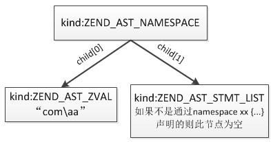

## 8.1 概述
什么是命名空间？从广义上来说，命名空间是一种封装事物的方法。在很多地方都可以见到这种抽象概念。例如，在操作系统中目录用来将相关文件分组，对于目录中的文件来说，它就扮演了命名空间的角色。具体举个例子，文件 foo.txt 可以同时在目录/home/greg 和 /home/other 中存在，但在同一个目录中不能存在两个 foo.txt 文件。另外，在目录 /home/greg 外访问 foo.txt 文件时，我们必须将目录名以及目录分隔符放在文件名之前得到 /home/greg/foo.txt。这个原理应用到程序设计领域就是命名空间的概念。(引用自php.net)

命名空间主要用来解决两类问题：
* 用户编写的代码与PHP内部的或第三方的类、函数、常量、接口名字冲突
* 为很长的标识符名称创建一个别名的名称，提高源代码的可读性

PHP命名空间提供了一种将相关的类、函数、常量和接口组合到一起的途径，不同命名空间的类、函数、常量、接口相互隔离不会冲突，注意：PHP命名空间只能隔离类、函数、常量和接口，不包括全局变量。

接下来的两节将介绍下PHP命名空间的内部实现，主要从命名空间的定义及使用两个方面分析。

## 8.2 命名空间的定义
### 8.2.1 定义语法
命名空间通过关键字namespace 来声明，如果一个文件中包含命名空间，它必须在其它所有代码之前声明命名空间，除了declare关键字以外，也就是说除declare之外任何代码都不能在namespace之前声明。另外，命名空间并没有文件限制，可以在多个文件中声明同一个命名空间，也可以在同一文件中声明多个命名空间。
```php
namespace com\aa;

const MY_CONST = 1234;
function my_func(){ /* ... */ }
class my_class { /* ... */ }
```
另外也可以通过{}将类、函数、常量封装在一个命名空间下：
```php
namespace com\aa{
    const MY_CONST = 1234;
    function my_func(){ /* ... */ }
    class my_class { /* ... */ }
}
```
但是同一个文件中这两种定义方式不能混用，下面这样的定义将是非法的：
```php
namespace com\aa{
    /* ... */
}

namespace com\bb;
/* ... */
```
如果没有定义任何命名空间，所有的类、函数和常量的定义都是在全局空间，与 PHP 引入命名空间概念前一样。

### 8.2.2 内部实现
命名空间的实现实际比较简单，当声明了一个命名空间后，接下来编译类、函数和常量时会把类名、函数名和常量名统一加上命名空间的名称作为前缀存储，也就是说声明在命名空间中的类、函数和常量的实际名称是被修改过的，这样来看他们与普通的定义方式是没有区别的，只是这个前缀是内核帮我们自动添加的，例如：
```php
//ns_define.php
namespace com\aa;

const MY_CONST = 1234;
function my_func(){ /* ... */ }
class my_class { /* ... */ }
```
最终MY_CONST、my_func、my_class在EG(zend_constants)、EG(function_table)、EG(class_table)中的实际存储名称被修改为：com\aa\MY_CONST、com\aa\my_func、com\aa\my_class。

下面具体看下编译过程，namespace语法被编译为ZEND_AST_NAMESPACE类型的语法树节点，它有两个子节点：child[0]为命名空间的名称、child[1]为通过{}方式定义时包裹的语句。



此节点的编译函数为zend_compile_namespace()：
```c
void zend_compile_namespace(zend_ast *ast)
{
    zend_ast *name_ast = ast->child[0];
    zend_ast *stmt_ast = ast->child[1];
    zend_string *name;
    zend_bool with_bracket = stmt_ast != NULL;

    //检查声明方式，不允许{}与非{}混用
    ...

    if (FC(current_namespace)) {
        zend_string_release(FC(current_namespace));
    }

    if (name_ast) {
        name = zend_ast_get_str(name_ast);

        if (ZEND_FETCH_CLASS_DEFAULT != zend_get_class_fetch_type(name)) {
            zend_error_noreturn(E_COMPILE_ERROR, "Cannot use '%s' as namespace name", ZSTR_VAL(name));
        }
        //将命名空间名称保存到FC(current_namespace)
        FC(current_namespace) = zend_string_copy(name);
    } else {
        FC(current_namespace) = NULL;
    }

    //重置use导入的命名空间符号表
    zend_reset_import_tables();
    ...
    if (stmt_ast) {
        //如果是通过namespace xxx { ... }这种方式声明的则直接编译{}中的语句
        zend_compile_top_stmt(stmt_ast);
        zend_end_namespace();
    }
}
```
从上面的编译过程可以看出，命名空间定义的编译过程非常简单，最主要的操作是把FC(current_namespace)设置为当前定义的命名空间名称，FC()这个宏为:CG(file_context)，前面曾介绍过，file_context是在编译过程中使用的一个结构：
```c
typedef struct _zend_file_context {
    zend_declarables declarables;
    znode implementing_class;

    //当前所属namespace
    zend_string *current_namespace;
    //是否在namespace中
    zend_bool in_namespace;
    //当前namespace是否为{}定义
    zend_bool has_bracketed_namespaces;

    //下面这三个值在后面介绍use时再说明，这里忽略即可
    HashTable *imports;
    HashTable *imports_function;
    HashTable *imports_const;
} zend_file_context;
```
编译完namespace声明语句后接着编译下面的语句，此后定义的类、函数、常量均属于此命名空间，直到遇到下一个namespace的定义，接下来继续分析下这三种类型编译过程中有何不同之处。

__(1)编译类、函数__

前面章节曾详细介绍过函数、类的编译过程，总结下主要分为两步：第1步是编译函数、类，这个过程将分别生成一条ZEND_DECLARE_FUNCTION、ZEND_DECLARE_CLASS的opcode；第2步是在整个脚本编译的最后执行zend_do_early_binding()，这一步相当于执行ZEND_DECLARE_FUNCTION、ZEND_DECLARE_CLASS，函数、类正是在这一步注册到EG(function_table)、EG(class_table)中去的。

在生成ZEND_DECLARE_FUNCTION、ZEND_DECLARE_CLASS两条opcode时会把函数名、类名的存储位置通过操作数记录下来，然后在zend_do_early_binding()阶段直接获取函数名、类名作为key注册到EG(function_table)、EG(class_table)中，定义在命名空间中的函数、类的名称修改正是在生成ZEND_DECLARE_FUNCTION、ZEND_DECLARE_CLASS时完成的，下面以函数为例看下具体的处理：
```c
//函数的编译方法
void zend_compile_func_decl(znode *result, zend_ast *ast)
{
    ...
    //生成函数声明的opcode：ZEND_DECLARE_FUNCTION
    zend_begin_func_decl(result, op_array, decl);
    
    //编译参数、函数体
    ...
}
```
```c
static void zend_begin_func_decl(znode *result, zend_op_array *op_array, zend_ast_decl *decl)
{
    ...
    //获取函数名称
    op_array->function_name = name = zend_prefix_with_ns(unqualified_name);
    lcname = zend_string_tolower(name);

    if (FC(imports_function)) {
        //如果通过use导入了其他命名空间则检查函数名称是否已存在
    }
    ....
    //生成一条opcode：ZEND_DECLARE_FUNCTION
    opline = get_next_op(CG(active_op_array));
    opline->opcode = ZEND_DECLARE_FUNCTION;
    //函数名的存储位置记录在op2中
    opline->op2_type = IS_CONST;
    LITERAL_STR(opline->op2, zend_string_copy(lcname));
    ...
}
```
函数名称通过zend_prefix_with_ns()方法获取：
```c
zend_string *zend_prefix_with_ns(zend_string *name) {
    if (FC(current_namespace)) {
        //如果当前是在namespace下则拼上namespace名称作为前缀
        zend_string *ns = FC(current_namespace);
        return zend_concat_names(ZSTR_VAL(ns), ZSTR_LEN(ns), ZSTR_VAL(name), ZSTR_LEN(name));
    } else {
        return zend_string_copy(name);
    }
}
```
在zend_prefix_with_ns()方法中如果发现FC(current_namespace)不为空则将函数名加上FC(current_namespace)作为前缀，接下来向EG(function_table)注册时就使用修改后的函数名作为key，类的情况与函数的处理方式相同，不再赘述。

__(2)编译常量__

常量的编译过程与函数、类基本相同，也是在编译过程获取常量名时检查FC(current_namespace)是否为空，如果不为空表示常量声明在namespace下，则为常量名加上FC(current_namespace)前缀。

总结下命名空间的定义：编译时如果发现定义了一个namespace，则将命名空间名称保存到FC(current_namespace)，编译类、函数、常量时先判断FC(current_namespace)是否为空，如果为空则按正常名称编译，如果不为空则将类名、函数名、常量名加上FC(current_namespace)作为前缀，然后再以修改后的名称注册。整个过程相当于PHP帮我们补全了类名、函数名、常量名。

## 8.3 命名空间的使用
### 8.3.1 基本用法
上一节我们知道了定义在命名空间中的类、函数和常量只是加上了namespace名称作为前缀，既然是这样那么在使用时加上同样的前缀是否就可以了呢？答案是肯定的，比如上面那个例子：在com\aa命名空间下定义了一个常量MY_CONST，那么就可以这么使用：
```php
include 'ns_define.php';

echo \com\aa\MY_CONST;
```
这种按照实际类名、函数名、常量名使用的方式很容易理解，与普通的类型没有差别，这种以"\"开头使用的名称称之为：完全限定名称，类似于绝对目录的概念，使用这种名称PHP会直接根据"\"之后的名称去对应的符号表中查找(namespace定义时前面是没有加"\"的，所以查找时也会去掉这个字符)。

除了这种形式的名称之外，还有两种形式的名称：
* __非限定名称:__ 即没有加任何namespace前缀的普通名称，比如my_func()，使用这种名称时如果当前有命名空间则会被解析为：currentnamespace\my_func，如果当前没有命名空间则按照原始名称my_func解析
* __部分限定名称:__ 即包含namespace前缀，但不是以"\"开始的，比如：aa\my_func()，类似相对路径的概念，这种名称解析规则比较复杂，如果当前空间没有使用use导入任何namespace那么与非限定名称的解析规则相同，即如果当前有命名空间则会把解析为：currentnamespace\aa\my_func，否则解析为aa\my_func，使用use的情况后面再作说明

### 8.3.2 use导入
使用一个命名空间中的类、函数、常量虽然可以通过完全限定名称的形式访问，但是这种方式需要在每一处使用的地方都加上完整的namespace名称，如果将来namespace名称变更了就需要所有使用的地方都改一遍，这将是很痛苦的一件事，为此，PHP提供了一种命名空间导入/别名的机制，可以通过use关键字将一个命名空间导入或者定义一个别名，然后在使用时就可以通过导入的namespace名称最后一个域或者别名访问，不需要使用完整的名称，比如：
```php
//ns_define.php
namespace aa\bb\cc\dd;

const MY_CONST = 1234;
```
可以采用如下几种方式使用：
```php
//方式1:
include 'ns_define.php';

use aa\bb\cc\dd;

echo dd\MY_CONST;
```
```php
//方式2:
include 'ns_define.php';

use aa\bb\cc;

echo cc\dd\MY_CONST;
```
```php
//方式3:
include 'ns_define.php';

use aa\bb\cc\dd as DD;

echo DD\MY_CONST;
```
```php
//方式4:
include 'ns_define.php';

use aa\bb\cc as CC;

echo CC\dd\MY_CONST;
```
这种机制的实现原理也比较简单：编译期间如果发现use语句 ，那么就将把这个use后的命名空间名称插入一个哈希表：FC(imports)，而哈希表的key就是定义的别名，如果没有定义别名则key使用按"\"分割的最后一节，比如方式2的情况将以cc作为key，即：FC(imports)["cc"] = "aa\bb\cc\dd"；接下来在使用类、函数和常量时会把名称按"\"分割，然后以第一节为key查找FC(imports)，如果找到了则将FC(imports)中保存的名称与使用时的名称拼接在一起，组成完整的名称。实际上这种机制是把完整的名称切割缩短然后缓存下来，使用时再拼接成完整的名称，也就是内核帮我们组装了名称，对内核而言，最终使用的都是包括完整namespace的名称。


use除了上面介绍的用法外还可以导入一个类，导入后再使用类就不需要加namespace了，例如：
```php
//ns_define.php
namespace aa\bb\cc\dd;

class my_class { /* ... */ }
```
```php
include 'ns_define.php';
//导入一个类
use aa\bb\cc\dd\my_class;
//直接使用
$obj = new my_class();
var_dump($obj);
```
use的这两种用法实现原理是一样的，都是在编译时通过查找FC(imports)实现的名称补全。从PHP 5.6起，use又提供了两种针对函数、常量的导入，可以通过`use function xxx`及`use const xxx`导入一个函数、常量，这种用法的实现原理与上面介绍的实际是相同，只是在编译时没有保存到FC(imports)，zend_file_context结构中的另外两个哈希表就是在这种情况下使用的：
```c
typedef struct _zend_file_context {
    ...
    //用于保存导入的类或命名空间
    HashTable *imports;
    //用于保存导入的函数
    HashTable *imports_function;
    //用于保存导入的常量
    HashTable *imports_const;
} zend_file_context;
```
简单总结下use的几种不同用法：
* __a.导入命名空间:__ 导入的名称保存在FC(imports)中，编译使用的语句时搜索此符号表进行补全
* __b.导入类:__ 导入的名称保存在FC(imports)中，与a不同的时如果不会根据"\"切割后的最后一节检索，而是直接使用类名查找
* __c.导入函数:__ 通过`use function`导入到FC(imports_function)，补全时先查找FC(imports_function)，如果没有找到则继续按照a的情况处理
* __d.导入常量:__ 通过`use const`导入到FC(imports_const)，不全是先查找FC(imports_const)，如果没有找到则继续按照a的情况处理

```php
use aa\bb;                  //导入namespace
use aa\bb\MY_CLASS;         //导入类
use function aa\bb\my_func; //导入函数
use const aa\bb\MY_CONST;   //导入常量
```
接下来看下内核的具体实现，首先看下use的编译：
```c
void zend_compile_use(zend_ast *ast)
{
    zend_string *current_ns = FC(current_namespace);
    //use的类型
    uint32_t type = ast->attr;
    //根据类型获取存储哈希表：FC(imports)、FC(imports_function)、FC(imports_const)
    HashTable *current_import = zend_get_import_ht(type);
    ...
    //use可以同时导入多个
    for (i = 0; i < list->children; ++i) {
        zend_ast *use_ast = list->child[i];
        zend_ast *old_name_ast = use_ast->child[0];
        zend_ast *new_name_ast = use_ast->child[1];
        //old_name为use后的namespace名称，new_name为as定义的别名
        zend_string *old_name = zend_ast_get_str(old_name_ast);
        zend_string *new_name, *lookup_name;

        if (new_name_ast) {
            //如果有as别名则直接使用
            new_name = zend_string_copy(zend_ast_get_str(new_name_ast));
        } else {
            const char *unqualified_name;
            size_t unqualified_name_len;
            if (zend_get_unqualified_name(old_name, &unqualified_name, &unqualified_name_len)) {
                //按"\"分割，取最后一节为new_name
                new_name = zend_string_init(unqualified_name, unqualified_name_len, 0);
            } else {
                //名称中没有"\"：use aa
                new_name = zend_string_copy(old_name);
            }
        }
        //如果是use const则大小写敏感，其它用法都转为小写
        if (case_sensitive) {
            lookup_name = zend_string_copy(new_name);
        } else {
            lookup_name = zend_string_tolower(new_name);
        }
        ...
        if (current_ns) {
            //如果当前是在命名空间中则需要检查名称是否冲突
            ...
        }

        //插入FC(imports/imports_function/imports_const)，key为lookup_name，value为old_name
        if (!zend_hash_add_ptr(current_import, lookup_name, old_name)) {
            ...
        }
    }
}
```
从use的编译过程可以看到，编译时的主要处理是把use导入的名称以别名或最后分节为key存储到对应的哈希表中，接下来我们看下在编译使用类、函数、常量的语句时是如何处理的。使用的语法类型比较多，比如类的使用就有new、访问静态属性、调用静态方法等，但是不管什么语句都会经历获取类名、函数名、常量名这一步，类名的补全就是在这一步完成的。

__(1)补全类名__

编译时通过zend_resolve_class_name()方法进行类名补全，如果没有任何namespace那么就返回原始的类名，比如编译`new my_class()`时，首先会把"my_class"传入该函数，如果查找FC(imports)后发现是一个use导入的类则把补全后的完整名称返回，然后再进行后续的处理。
```c
zend_string *zend_resolve_class_name(zend_string *name, uint32_t type)
{
    char *compound;
    //"namespace\xxx\类名"这种用法表示使用当前命名空间
    if (type == ZEND_NAME_RELATIVE) {
        return zend_prefix_with_ns(name);
    }

    //完全限定的形式：new \aa\bb\my_class()
    if (type == ZEND_NAME_FQ || ZSTR_VAL(name)[0] == '\\') {
        if (ZSTR_VAL(name)[0] == '\\') {
            name = zend_string_init(ZSTR_VAL(name) + 1, ZSTR_LEN(name) - 1, 0);
        } else {
            zend_string_addref(name);
        }
        ...
        return name;
    }
   
    //如果当前脚本有通过use导入namespace
    if (FC(imports)) {
        compound = memchr(ZSTR_VAL(name), '\\', ZSTR_LEN(name));
        if (compound) {
            // 1) 没有直接导入一个类的情况，用法a
            //名称中包括"\"，比如：new aa\bb\my_class()
            size_t len = compound - ZSTR_VAL(name);
            //根据按"\"分割后的最后一节为key查找FC(imports)
            zend_string *import_name =
                zend_hash_find_ptr_lc(FC(imports), ZSTR_VAL(name), len);
            //如果找到了表示通过use导入了namespace
            if (import_name) {
                return zend_concat_names(
                    ZSTR_VAL(import_name), ZSTR_LEN(import_name), ZSTR_VAL(name) + len + 1, ZSTR_LEN(name) - len - 1);
            }
        } else {
            // 2) 通过use导入一个类的情况，用法b
            //直接根据原始类名查找
            zend_string *import_name
                = zend_hash_find_ptr_lc(FC(imports), ZSTR_VAL(name), ZSTR_LEN(name));

            if (import_name) {
                return zend_string_copy(import_name);
            }
        }
    }
    //没有使用use或没命中任何use导入的namespace，按照基本用法处理：如果当前在一个namespace下则解释为currentnamespace\my_class
    return zend_prefix_with_ns(name);
}
```
此方法除了类的名称后还有一个type参数，这个参数是解析语法是根据使用方式确定的，共有三种类型：
* __ZEND_NAME_NOT_FQ:__ 非限定名称，也就是普通的类名，没有加namespace，比如：new my_class()
* __ZEND_NAME_RELATIVE:__ 相对名称，强制按照当前所属命名空间解析，使用时通过在类前加"namespace\xx"，比如：new namespace\my_class()，如果当前是全局空间则等价于:new my_class，如果当前命名空间为currentnamespace，则解析为"currentnamespace\my_class"
* __ZEND_NAME_FQ:__ 完全限定名称，即以"\"开头的

__(2)补全函数名、常量名__

函数与常量名称的补全操作是相同的:
```c
//补全函数名称
zend_string *zend_resolve_function_name(zend_string *name, uint32_t type, zend_bool *is_fully_qualified)
{   
    return zend_resolve_non_class_name( 
        name, type, is_fully_qualified, 0, FC(imports_function));
}
//补全常量名称
zend_string *zend_resolve_const_name(zend_string *name, uint32_t type, zend_bool *is_fully_qualified)
    return zend_resolve_non_class_name(
        name, type, is_fully_qualified, 1, FC(imports_const));
}
```
可以看到函数与常量最终调用同一方法处理，不同点在于传入了各自的存储哈希表：
```c
zend_string *zend_resolve_non_class_name(
    zend_string *name, uint32_t type, zend_bool *is_fully_qualified,
    zend_bool case_sensitive, HashTable *current_import_sub
) {
    char *compound;
    *is_fully_qualified = 0;
    //完整名称，直接返回，不需要补全
    if (ZSTR_VAL(name)[0] == '\\') {
        *is_fully_qualified = 1;
        return zend_string_init(ZSTR_VAL(name) + 1, ZSTR_LEN(name) - 1, 0);
    }
    //与类的用法相同
    if (type == ZEND_NAME_RELATIVE) {
        *is_fully_qualified = 1;
        return zend_prefix_with_ns(name);
    }
    //current_import_sub如果是函数则为FC(imports_function)，否则为FC(imports_const)
    if (current_import_sub) {
        //查找FC(imports_function)或FC(imports_const)
        ...
    }
    //查找FC(imports)
    compound = memchr(ZSTR_VAL(name), '\\', ZSTR_LEN(name));
    ...

    return zend_prefix_with_ns(name);
}
```
可以看到，函数与常量的的补全逻辑只是优先用原始名称去FC(imports_function)或FC(imports_const)查找，如果没有找到再去FC(imports)中匹配。如果我们这样导入了一个函数：`use aa\bb\my_func;`，编译`my_func()`会在FC(imports_function)中根据"my_func"找到"aa\bb\my_func"，从而使用完整的这个名称。

### 8.3.3 动态用法
前面介绍的这些命名空间的使用都是名称为CONST类型的情况，所有的处理都是在编译环节完成的，PHP是动态语言，能否动态使用命名空间呢？举个例子：
```php
$class_name = "\aa\bb\my_class";
$obj = new $class_name;
```
如果类似这样的用法只能只用完全限定名称，也就是按照实际存储的名称使用，无法进行自动名称补全。

